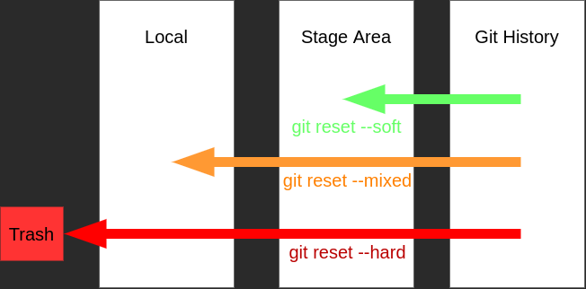

<!-- Logos -->
<p align="center">

  
  &nbsp;&nbsp;&nbsp;&nbsp;&nbsp;&nbsp;&nbsp;&nbsp;&nbsp;&nbsp;&nbsp;&nbsp;
  
  

</p>

<!-- Shields -->

<!-- ALL-CONTRIBUTORS-BADGE:START - Do not remove or modify this section -->
[](#contributors-)
<!-- ALL-CONTRIBUTORS-BADGE:END -->


<!-- Badges -->


## !!! [Work in Progress](TODO.md)

# Git, GitHub & GitLab Guide

This repository contains

- Quick and Advanced Git guide
- GitHub and GitLab usage guide
- Version Control examples and recommendations

#
<!-- Table of Contents -->
<details>
  <summary>Table of Contents</summary>
    <li><a href="#Git">Git</a></li>
    <li><a href="#GitLab">GitHub</a></li>
    <li><a href="#GitLab">GitLab</a></li>
    <li><a href="#Contribute">Contribute</a></li>
    <li><a href="#License">License</a></li>
    <li><a href="#References">References</a></li>
    <li><a href="#Contributors">Contributors</a></li>
  </ol>
</details>

<!-- Guide -->
#

## Git

- Download & install [Git](https://git-scm.com/downloads)

For Debian/Ubuntu

```bash
apt-get install git
```

#

- Check git version & installation

```bash
git --version
```

#

- Initialize git configurations

```bash
git config --global user.name "user_name"
git config --global user.email "email"
```

#

- Configure the main branch name as "main" (For older Git versions)
  
  The latest version of git comes with the default branch name as "main".

  Some older version "master" name is hard coded, so they needed to be changed manually.

```bash
git config --global init.defaultBranch main
```

#

- Configure Visual Studio Code for Git functions

```bash
git config --global core.editor 'code --wait --new-window'
git config --global diff.tool vscode
git config --global difftool.vscode.cmd'code --wait --diff $LOCAL $REMOTE'
git config --global merge.tool vscode
git config --global mergetool.vscode.cmd'code --wait $MERGED'
```

- Unset a git configuration

```bash
git config --global --unset <option>
git config --global --unset core.editor # Remove core.editor from configuration
```

#

In order to work on the GitHub repositories, we either need to create PAT or generate an SSH key pair. If we are not planning to use GitHub we can skip this step.

- [Personal Access Token (PAT)](https://docs.github.com/en/authentication/keeping-your-account-and-data-secure/creating-a-personal-access-token)
  
  Generated PAT will be used instead of a user password for Git operations connected to GitHub. Don't forget it and store it in a safe place.

  GitHub :arrow_right: Settings :arrow_right: Developer Settings :arrow_right: [Personal Access Token](https://github.com/settings/tokens)

- [SSH](https://docs.github.com/en/authentication/connecting-to-github-with-ssh/adding-a-new-ssh-key-to-your-github-account)

  We need to create a new SSH key, generated key pair will be used to authenticate to GitHub. Generate a new ssh-key and add public key to [GitHub-SSH and GPG keys](https://github.com/settings/keys).

  GitHub :arrow_right: Settings :arrow_right: [SSH and GPG keys](https://github.com/settings/keys)
  
```bash
ssh-keygen -t ed25519 -C "email" # Create a new SSH key
```

```bash
eval "$(ssh-agent -s)" # Start SHH-agent
```

```bash
ssh-add ~/.ssh/id_ed25519 # Add SSH key 
```

```bash
cat ~/.ssh/id_ed25519.pub # Copy the ed25519 public key
```

#

- Create a new Git repository

  Create new repository, every file already inside will be untracked condition

```bash
git init
```

- Clone Git repository

  Clone a remote repository to local system

```bash
git clone <repository_link(HTTPS or SSH)>
```

#

- Create a gitignore file
  
  Gitignore file is used to ignore files in the repository that we don't want to track changes or avoid uploading them to remote repositories.

| .gitignore | Description |
| ----------- | ----------- |
| venv/ | Ignore all "venv" folders |
| *.orig | Ignore all files ending with ".orig" |
| *.py[cod] | Ignore all files ending with ".pyc", "pyo" and "pyd" |
| !dont_ignore_this_file | Don't ignore this file |
| ignore_this_file | Ignore this file |
| /database | Ignore "database" named folder under "/" |
| doc/*.txt | Ignore all files ending with ".txt" under "doc/" folder |
| doc/**/*.pcd | Ignore all files ending ".pcd" under "doc/" and it's sub folders |

```bash
touch .gitignore # Create .gitignore file
```

#### [GitHub .gitignore templates](https://github.com/github/gitignore)

#

- Create a git commit message template file
  
  To keep git history clean and understandable, every commit done to any repository needed to be in a clear format. We need to use commit templates, repositories suggest we use.

```bash
touch .gitmessage # Create .gitmessage file
```

```bash
git config --global commit.template ~/.gitmessage
```

#### [Example git commit message template](.gitmessage)

#

- Create a GitHub pull request template file

  GitHub pull requests are used for reviewing the process of adding new feature branches to repositories. It is a review state of the feature. To keep a feature or change clear and understandable, we use the given pull request template.
  
```bash
mkdir .github # Create a .github folder
touch .github/pull_request_template.md # Create pull_request_template.md file
```

#### [Example pull request template](.github/pull_request_template.md)

#### [Creating a pull request template for your repository](https://docs.github.com/en/communities/using-templates-to-encourage-useful-issues-and-pull-requests/creating-a-pull-request-template-for-your-repository)

#

- Create a contributing.md template file

  Open-source projects are usually supported by contributors. To determine how someone can contribute and help to our project, we define a contributing guide.

```bash
touch .contributing.md # Create .contributing.md file
```

#### [Example contributing.md file](contributing.md)

#

- Check git repository status

  Repository status information gives what has changed inside our repository.

  Git tracks each and every change done to tracked files, no data can be lost or corrupted, without willingly removing files from the repository.

```bash
git status
```

#

- Add changes to the Staging area

  Inside a git repository, files can either be tracked or untracked.
  Untracked changes are not tracked by git.
  
  Tracked files can either be unmodified, modified, or staged. We can check file states inside our repository with **git status**. Before committing changes, we put them inside the staging area with **git add**.

```bash
git add <changed_file> # Add changed file to stage area
git add . # Stage all changes
```

Git Version 2.x
| Command | New Files| Modified Files | Deleted Files | Description |
| ----------- | ----------- | ----------- | ----------- | ----------- |
| git add -A | :white_check_mark: | :white_check_mark: | :white_check_mark: | Stage all changes |
| git add . | :white_check_mark: | :white_check_mark: | :white_check_mark: | Stage all changes |
| git add --ignore-removal . | :white_check_mark: | :white_check_mark: | :x: | Stage only new and modified files |
| git add -u | :x: | :white_check_mark: | :white_check_mark: | Add modified and deleted files to stage area |

[source](https://stackoverflow.com/a/26039014/14896772)

#

- Commit staged files

  Stages changes need to be committed. When a commit has been made, the current state of the project is saved inside git. 

```bash
git commit # Commit staged changes
git commit -a  # Commit all changes, skip the staging area
git commit -m "<commit_message>" # Commit directly with passed commit 
git commit -a -m "<commit_message>"
```

- Amend a commit

  With the optional **--amend** command, we can modify the last commit. Staged changes will be added inside the previous commit.

```bash
git commit --amend
```

#
- Git Pointers

  Inside git, each commit is saved with a unique [SHA1 hash](https://en.wikipedia.org/wiki/Cryptographic_hash_function). 
  
  Also, some important commits have pointers. Creating a branch or tag creates a unique pointer name to direct commit. 
  
  The **HEAD** pointer always points to the current commit. As we make new commits, change branches/tags or return to past commits, the HEAD pointer will also move with us.

- Git History
  
  Git tracks the detailed history of each commit done. We can inspect changes done inside each commit, revert them or turn the project back to the state in which the commit was made.

```bash
git log # Show git history
```

- Git Commit Details
  
  Inside each commit, author, commit date, commit message, and changes done recorded. 
  
```bash
git show <commit_id> # Show commit details
git show HEAD # Show HEAD details
```

- Inspect Changes

  Differences between two commits can be observed

```bash
git diff # Inspect current changes compared to the latest commit(HEAD)
git diff --staged # Inspect changes inside the staged area compared to the latest commit(HEAD)
git diff <commid_id> # Inspect changes between current changes and given commit_id
git diff <commit_id> <commit_id> # Inspect changes between given two commits
```

- Git difftool

  Git allows us to use different tools for git operations. By default, git uses a system editor. We can manually use these tools or change git config preferences and change default git tools.

```bash
git difftool # Open git difftool
git difftool --toll=<tool> # Open given git difftool
git difftool <commid_id> # Inspect changes between current and given commit
git difftool <commit_id> <commid_id> # Inspect changes between give to commits
git difftool HEAD~x #  Inspect changes between current and "x" previous commits
```
#

- Undoing changes
  
  Git reset is a powerful tool used for undoing changes inside git.  
  
  We can return to an older commit and revert history to it. 

  There are 3 options for git reset. By default **git reset** uses **--mixed** option.

```bash
git reset --soft # Revert changes from git history back to current commit, keep changes in the stage area.
```
```bash
git reset --mixed # (Default) Revert changes from git history and staging area till current commit, keep changes as local changes.
```
```bash
git reset --hard # (!!Destructive) Revert changes back to the current commit, and delete all saves inside git till this commit.
```
<p align="center">
  
</p>

- Revert changes

  Git allows us to directly reverse apply commits. **git revert** create a new commit reverting the given commit.

```bash
git revert <commit_id> # Revert given commit changes
```

- Restore changes to a file

  We can restore changes done to file.
  
```bash
<make a change to a file>
git restore <file>
```

- Unstage changes back to index area

  Staged changes can be unstaged back.

```bash
--make a change to a file--
git add <file>
git restore --stage <file>
```

#

- Untrack files inside git repositories
  
  When we want to delete files from a repository, we either directly delete the files or we use **git rm**.

```bash
git rm # Remove files from the repository and file system and untrack
git rm --cached # Untrack file but keep it inside file system
```

#

- Tagging important development points

  During development, important waypoints can be tracked by git, for example, version 1.0 of a project is an important waypoint.

  There are 2 tag options, lightweight and annotated. Lightweight tags are just pointers to certain commits, however, annotated tags are more complex tags. Annotated tags are stored as [full objects](https://git-scm.com/book/en/v2/Git-Basics-Tagging).


```bash
git tag # Show tag list
git tag <tag_name> # Create lightweight tag
git tag -a <tag_name> -m "tag_message" # Create annotated tag and add tag message
```

#

- Checkout to a commit
  
  With checkout we can change our HEAD pointer to a any commit inside history. When we checkout to a commit, which not the latest inside its commit tree or has no pointer assigned to it like tag or branch, we enter into detached HEAD state. 
  
  Detached HEAD state is not an error, it is just a warning to user. We can view changes and make experimental changes inside detached HEAD state, however in order to make a change we need to create an new branch and commit our changes into the branch.

```bash
git checkout <commit_id> # Checkout to a commit
git checkout <branch> # Checkout to a branch
git checkout <tag> # Checkout to a tag
git checkout HEAD~2 # Checkout to 2 commit earlier of HEAD pointer
```

#

- Create branches

  Branching is creating an isolated copy of the current branch or commit. A branch is just a pointer to a certain commit object. With branching, we can isolate our work from main/master branches and continue our development without affecting other branches.

  It is good practice to create a new branch per feature, make development inside it, then merge it into a main/master branch. After development end on a branch and it is merged, it can be deleted, to minimize individual branch count.

```bash
git branch # List branches
git branch -a # List all branches 
git branch <branch_name> # Create new branch
git branch -m <current_name> <new_name> # Change name of a branch
git branch -d <branch> # Delete branch
```

```bash
git branch -m <branch_name> # Create new branch and checkout to it
git checkout -b <branch_name> # Create new branch and checkout to it
git switch -c <branch_name> # Create new branch and checkout to it
```

- Merge branches

  When we want to apply changes inside an branch into other branch, we merge them together. After merge both branch pointers will point to the same new merge commit.

```bash
git merge <branch_name> # Merge named branch into current branch
```

- Merge conflicts

  When merging branches git will try to merge all changes possible, however, if there are different edits on the same lines on both branches, the merge will fail, and merge conflicts will happen.

  Merge conflicts, needed to be handled by hand. When merge conflicts arise, git will automatically mark the problem file and highlight the conflicting changes inside with **"==="**, **"<<<"**, and **">>>"**. As the user, we need to manually resolve the conflict by removing "<<< current_change === incoming_change >>>" and writing the changes we want to keep. After resolving the conflict, we need to git add and git commit the conflict. This commit will automatically fill the commit message as merge messge.

```bash
git merge <branch_name>
--merge conflict--
```

```
cat <conflicting_file>
...
<<<<<<< HEAD
current changes
=======
incoming changes
>>>>>>> feature_branch
...
```

- Git mergetool

  Git allow us to use, other tools to resolve merge conflicts. These tools can allow us to resolve conflicts more easly and faster.

```bash
git mergetool # Use default mergetool
git mergetool --tool=<tool> # Uses selected mergetool
```

#


## GitHub

## GitLab

#

<!-- Contribuing to Project -->
## Contribute

We welcome every contribution, suggestion and improvement

We will try to address all issues as soon possible

See [the contributing guide](contributing.md) for more details


<!-- License -->
## License

Distributed under the MIT License. See [LICENSE](LICENSE) for more information.

# References

## Learning

- [Git Tutorial](https://git-scm.com/docs/gittutorial)
- [Pro Git book](https://git-scm.com/book/en/v2)
- [GitHub Docs](https://docs.github.com/en)
- [GitLab Docs](https://docs.gitlab.com/)
- [Atlassian Bitbucket Tutorial](https://www.atlassian.com/git)

## Logos & Images

- [Git](https://git-scm.com/downloads/logos)
- [GitHub](https://github.com/logos)
- [GitLab](https://about.gitlab.com/press/press-kit/)

<!-- Contributors -->
## Contributors

<!-- ALL-CONTRIBUTORS-LIST:START - Do not remove or modify this section -->
<!-- prettier-ignore-start -->
<!-- markdownlint-disable -->
<table>
  <tbody>
    <tr>
      <td align="center"><a href="https://github.com/FurkanEdizkan"><br /><sub><b>Furkan Edizkan</b></sub></a><br /><a href="https://github.com/FurkanEdizkan/Git-GitHub-GitLab-Tutorial/commits?author=FurkanEdizkan" title="Code">💻</a> <a href="#content-FurkanEdizkan" title="Content">🖋</a> <a href="https://github.com/FurkanEdizkan/Git-GitHub-GitLab-Tutorial/commits?author=FurkanEdizkan" title="Documentation">📖</a> <a href="#design-FurkanEdizkan" title="Design">🎨</a> <a href="#maintenance-FurkanEdizkan" title="Maintenance">🚧</a> <a href="#tutorial-FurkanEdizkan" title="Tutorials">✅</a></td>
      <td align="center"><a href="https://allcontributors.org"><br /><sub><b>All Contributors</b></sub></a><br /><a href="#design-all-contributors" title="Design">🎨</a> <a href="#tool-all-contributors" title="Tools">🔧</a></td>
      <td align="center"><a href="https://github.com/Akerdogmus"><br /><sub><b>Alim Kerem Erdoğmuş</b></sub></a><br /><a href="#tool-Akerdogmus" title="Tools">🔧</a> <a href="https://github.com/FurkanEdizkan/Git-GitHub-GitLab-Tutorial/commits?author=Akerdogmus" title="Tests">⚠️</a> <a href="#userTesting-Akerdogmus" title="User Testing">📓</a> <a href="#talk-Akerdogmus" title="Talks">📢</a></td>
      <td align="center"><a href="https://github.com/ramazanakkulak"><br /><sub><b>Ramazan Akkulak</b></sub></a><br /><a href="#tutorial-ramazanakkulak" title="Tutorials">✅</a> <a href="https://github.com/FurkanEdizkan/Git-GitHub-GitLab-Tutorial/commits?author=ramazanakkulak" title="Tests">⚠️</a></td>
    </tr>
  </tbody>
</table>

<!-- markdownlint-restore -->
<!-- prettier-ignore-end -->

<!-- ALL-CONTRIBUTORS-LIST:END -->
<!-- prettier-ignore-start -->
<!-- markdownlint-disable -->

<!-- markdownlint-restore -->
<!-- prettier-ignore-end -->

<!-- ALL-CONTRIBUTORS-LIST:END -->
